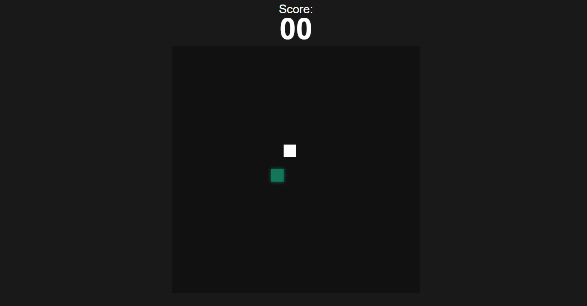

# Jogo da cobra (Snake Game)🐍

# Descrição

    O Jogo da Cobra é um clássico jogo de arcade em que o jogador controla uma cobra que se move pela tela em busca de comida. Conforme a cobra come a comida, ela cresce de tamanho. O objetivo do jogo é evitar colisões com as bordas da tela e com o próprio corpo da cobra enquanto se esforça para comer o máximo de comida possível e marcar a maior pontuação.

# Regras do jogo

    1- A cobra se move continuamente na direção em que foi comandada pelo jogador (para cima, para baixo, para a esquerda ou para a direita).
    2- Se a cabeça da cobra atingir a borda da tela, o jogo termina.
    3- Se a cabeça da cobra colidir com o corpo, o jogo termina.
    4- Quando a cobra come a comida, sua pontuação aumenta e ela cresce de tamanho.
    5- O jogador pode controlar a direção da cobra usando as teclas de seta.

## Tecnologias usadas

- HTML
- CSS
- JavaScript

# Contribuições

Contribuições são bem-vindas! Se você encontrar problemas, tiver sugestões ou quiser melhorar o jogo da cobra, sinta-se à vontade para abrir uma issue ou enviar um pull request.

# Agradecimentos

O jogo da cobra foi inspirado nos clássicos jogos de arcade e em vários tutoriais e projetos de código aberto disponíveis online. Um agradecimento especial a todos os desenvolvedores que compartilharam seus conhecimentos e código.
